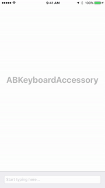

<p align="center">
  
</p>

[](http://cocoapods.org/pods/ABKeyboardAccessory)
[](http://cocoapods.org/pods/ABKeyboardAccessory)
[](http://cocoapods.org/pods/ABKeyboardAccessory)

## Screenshots



## Description

ABKeyboardAccessory makes it easier to determine when a keyboard is being shown/dismissed for UITextViews and UITextFields. ABKeyboardAccessory subclasses UIView, and is implemented by setting the ABKeyboardView as the 'inputAccessory' for the desired UITextView/UITextField. ABKeyboardAccesoryDelegate provides methods which relay information about the current frame of the ABKeyboardAccessory view, where one can adjust UI depending on the keyboard appearance.

## Example

To run the example project, clone the repo, and run `pod install` from the Example directory first.

## Requirements

* Requires iOS 8.0 or later
* Requires Automatic Reference Counting (ARC)

## Installation

ABKeyboardAccessory is available through [CocoaPods](http://cocoapods.org). To install
it, simply add the following line to your Podfile:

```ruby
pod "ABKeyboardAccessory"
```

## Initialization

When looking to initialize an ABKeyboardAccessory, it is as simple as one line. In one line, the ABKeyboardAccessory is set as the 'inputAccessory' for the designated UITextView/UITextField, and the delegate is set as well.

```objective-c
self.textField.inputAccessoryView = [[ABKeyboardAccessory alloc] initWithDelegate:self];
```

## Delegate

After initialization, the second step is to utilize either one of the ABKeyboardAccessoryDelegate methods to adjust the offset of the UITextView/UITextField.

```objective-c
/// Called when the keyboard frame changes, and privides a listener for the ABKeyboardAccessory frame position changing. Useful if determining offset when textView/textField is not flush with bottom of screen.
- (void) accessoryOffsetDidChange:(CGFloat)yOffset {
    [self.view layoutIfNeeded];
    self.bottomOffset.constant = yOffset;
    
    [UIView animateWithDuration:0.001f animations:^{
        [self.view layoutIfNeeded];
    }];
}

/// Called when the keyboard frame changes, and privides a listener for the ABKeyboardAccessory vertical offset position changing
- (void) didMoveKeyboardWithFrame:(CGRect)frame {
    CGRect windowFrame = [[[UIApplication sharedApplication] keyWindow] frame];

    CGFloat yOffset = windowFrame.size.height - frame.origin.y;
    [self.view layoutIfNeeded];
    self.bottomOffset.constant = yOffset;
    [UIView animateWithDuration:0.001f animations:^{
        [self.view layoutIfNeeded];
    }];
}
```

## Author

andrewboryk, andrewcboryk@gmail.com

## License

ABKeyboardAccessory is available under the MIT license. See the LICENSE file for more info.
