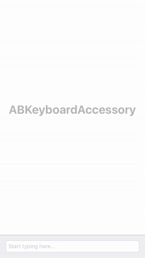

<p align="center">
  
</p>

[](http://cocoapods.org/pods/ABKeyboardAccessory)
[](http://cocoapods.org/pods/ABKeyboardAccessory)
[](http://cocoapods.org/pods/ABKeyboardAccessory)

## Screenshots



## Description

ABKeyboardAccessory makes it easier to determine when a keyboard is being shown/dismissed for UITextViews and UITextFields. ABKeyboardAccessory subclasses UIView, and is implemented by setting the ABKeyboardView as the 'inputAccessory' for the desired UITextView/UITextField. ABKeyboardAccesoryDelegate provides methods which relay information about the current frame of the ABKeyboardAccessory view, where one can adjust UI depending on the keyboard appearance.

## Example

To run the example project, clone the repo, and run `pod install` from the Example directory first.

## Requirements

* Requires iOS 8.0 or later
* Requires Automatic Reference Counting (ARC)

## Installation

ABKeyboardAccessory is available through [CocoaPods](http://cocoapods.org). To install
it, simply add the following line to your Podfile:

```ruby
pod "ABKeyboardAccessory"
```

## Author

andrewboryk, andrewcboryk@gmail.com

## License

ABKeyboardAccessory is available under the MIT license. See the LICENSE file for more info.
